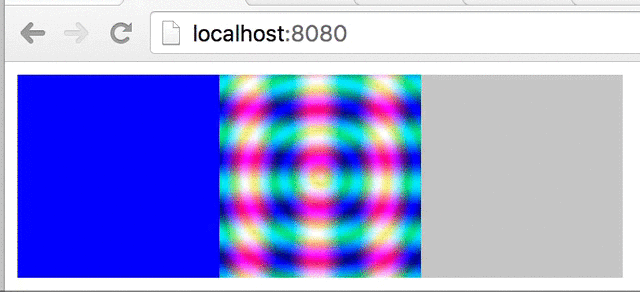

# Reflex Screen Widget

A Reflex widget that displays a dynamic Haskell image on the screen using `Canvas` and `onRequestAnimationFrame`.



---

## Usage

This code creates a constant 128x128 blue image signal and renders it to a
canvas using `screenWidget`.

```haskell
import Reflex.Dom (mainWidget, constant, MonadWidget)
import Reflex.Dom.Widget.Screen (screenWidget, ByteImageRgba(ByteImageRgba))
import qualified Data.ByteString as BS

blueScreen :: forall t m . MonadWidget t m => m ()
blueScreen = do
    let width  = 128
    let height = 128
    let blue   = [0, 0, 255, 255] -- [Red, Green, Blue, Alpha]
    let buffer = BS.pack $ concat $ replicate (width*height) blue
    let image  = ByteImageRgba width height buffer
    screenCanvas <- screenWidget (constant image)
    return ()
```

You can see the code for this and the other 2 examples above [on this file](https://github.com/maiavictor/ReflexScreenWidget/src/Main.hs). The resulting HTML/JS is [available live here](http://maiavictor.github.io/ReflexScreenWidget/).
